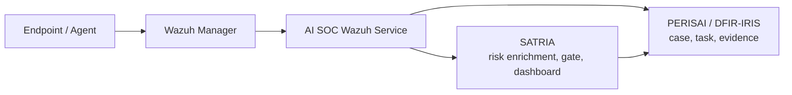

# Integrasi AI SOC Wazuh dengan SATRIA dan PERISAI

## Navigasi Dokumen Terkait

- [Index Dokumentasi SATRIA](README.md)
- [01 - Ringkasan SATRIA](01-RINGKASAN-SATRIA.md)
- [02 - SOP Hulu Hilir Per Tim](02-SOP-HULU-HILIR-PER-TIM.md)
- [03 - Panduan Operasional SOC](03-PANDUAN-OPERASIONAL-SOC.md)
- [04 - Skenario Jenkins ke SATRIA](04-SKENARIO-JENKINS-KE-SATRIA.md)
- [05 - Integrasi Wazuh ke PERISAI](05-INTEGRASI-WAZUH-KE-PERISAI.md)

## Keputusan Penempatan

Rekomendasi saat ini: jalankan AI SOC Wazuh sebagai service pendamping di server SATRIA/PUSAKA atau node analitik terpisah, bukan sebagai beban utama di Wazuh Manager.

Alasannya:

- Wazuh Manager sebaiknya fokus pada pengumpulan event, normalisasi, rule matching, dan alerting.
- AI SOC memerlukan proses enrichment, korelasi, deduplikasi, scoring, rekomendasi triase, dan komunikasi API yang lebih fleksibel.
- SATRIA/PUSAKA lebih dekat dengan endpoint orkestrasi dan ticket monitoring sehingga pengelolaan token, retry, observability, serta data operasional lebih rapi.
- Jika volume alert meningkat, AI SOC dapat dipindahkan ke node analitik khusus tanpa mengubah Wazuh Manager.

Untuk PoC dan operasional awal, letakkan AI SOC sebagai container pendamping pada server SATRIA/PUSAKA. Untuk production matang, gunakan node analitik khusus bila volume alert tinggi atau model inference membutuhkan resource besar.

## Arsitektur Alur



## Peran Komponen

| Komponen | Peran | Penempatan Disarankan |
|---|---|---|
| Wazuh Manager | Sumber alert SIEM, rules, agent telemetry, dan event keamanan. | Server Wazuh. |
| AI SOC Wazuh | Enrichment, korelasi alert, deduplikasi, risk scoring, rekomendasi triase, dan routing ke SATRIA/PERISAI. | Server SATRIA/PUSAKA untuk fase awal, atau node analitik khusus untuk volume besar. |
| SATRIA | Orkestrasi aset, scan, gate policy, dashboard, dan publish ticket. | Server SATRIA/PUSAKA. |
| PERISAI / DFIR-IRIS | Case management, task, evidence, activity log, dan workflow investigasi. | Server PERISAI. |

## Mode Operasi

| Mode | Kegunaan | Catatan |
|---|---|---|
| `mock` | Demo, training, dan validasi format data tanpa koneksi produksi. | Aman untuk presentasi dan workshop. |
| `hybrid` | Membaca alert real, tetapi output ke SATRIA/PERISAI masih dapat dibatasi. | Cocok untuk uji integrasi bertahap. |
| `real` | Alert real diproses, diperkaya, dan dapat diteruskan ke SATRIA/PERISAI. | Wajib memakai token dan allowlist resmi. |

## Environment Minimum

Gunakan file `.env` lokal di server runtime. Jangan menaruh nilai asli di repository.

```env
AISOC_MODE=mock
AISOC_WORKSPACE=/app/workspace
AISOC_RUN_DIR=/app/workspace/runs/demo
AISOC_MIN_LEVEL=3

WAZUH_API_URL=https://<WAZUH_HOST>
WAZUH_API_USER=<WAZUH_API_USER>
WAZUH_API_PASSWORD=<WAZUH_API_PASSWORD>
WAZUH_ALERTS_PATH=/input/wazuh-alerts/wazuh_alerts.jsonl

SATRIA_BASE_URL=http://<SATRIA_HOST>:<SATRIA_PORT>
SATRIA_SERVICE_TOKEN=<SATRIA_SERVICE_TOKEN>

PERISAI_BASE_URL=https://<PERISAI_HOST>:<PERISAI_PORT>
PERISAI_API_KEY=<PERISAI_API_KEY>

AI_MODEL_ENDPOINT=<OPTIONAL_AI_MODEL_ENDPOINT>
AI_MODEL_API_KEY=<OPTIONAL_AI_MODEL_API_KEY>
```

## Alur Hulu ke Hilir

1. Wazuh menerima event dari agent, rules, atau integrasi endpoint.
2. Alert level tertentu dikirim atau dibaca oleh AI SOC Wazuh.
3. AI SOC melakukan deduplikasi, korelasi host/user/rule, enrichment MITRE, serta prioritas risiko.
4. Alert yang relevan dibuatkan konteks operasional untuk SATRIA.
5. SATRIA menampilkan ringkasan, status risiko, dan rekomendasi tindak lanjut.
6. Bila membutuhkan workflow formal, SATRIA atau AI SOC meneruskan konteks ke PERISAI.
7. PERISAI menjadi tempat utama untuk case, task, evidence, analisis, dan penutupan insiden.
8. SATRIA membaca status ticket/case dari PERISAI secara monitoring.

## SOP Per Tim

| Tim | Aktivitas |
|---|---|
| Platform / Infrastruktur | Menjalankan container AI SOC, mengelola environment variable, volume, network, backup, dan log. |
| SOC L1 | Meninjau alert baru, melihat rekomendasi triase, melakukan verifikasi awal, dan eskalasi bila valid. |
| SOC L2 | Melakukan analisis korelasi, validasi false positive, enrichment evidence, dan rekomendasi containment. |
| SOC L3 | Menentukan strategi response, threat hunting lanjutan, root cause analysis, dan lesson learned. |
| DevSecOps | Menghubungkan hasil alert dengan aset, build, release, atau dependency yang relevan di SATRIA. |
| Pimpinan / Stakeholder | Membaca dashboard ringkasan tren, volume alert, status case, dan SLA tindak lanjut. |

## Smoke Test Yang Disarankan

1. Jalankan AI SOC dalam mode `mock`.
2. Masukkan sampel alert Wazuh anonim ke folder input.
3. Pastikan AI SOC menghasilkan enrichment dan risk score.
4. Pastikan SATRIA menerima ringkasan atau status intake.
5. Pastikan PERISAI menerima case hanya bila rule routing mengizinkan.
6. Pastikan tidak ada token, password, IP internal, atau API key tercetak di log publik.
7. Uji mode `hybrid` sebelum mengaktifkan mode `real`.

## Guardrail Operasional

- Jangan menjalankan model enrichment langsung di Wazuh Manager bila membebani rule engine.
- Gunakan allowlist target dan token service account dengan scope minimum.
- Gunakan retry queue agar kegagalan API tidak menghilangkan alert.
- Simpan raw alert sesuai kebijakan retensi dan klasifikasi data.
- Pisahkan data demo dari data operasional.
- Masking username, hostname sensitif, token, dan alamat internal pada dokumentasi.

## Backlog Pengembangan

- Dashboard AI SOC di SATRIA untuk tren alert, confidence, dan top correlated entity.
- Sinkronisasi status case PERISAI ke konteks alert AI SOC.
- Model prompt/template rekomendasi triase per rule group Wazuh.
- Auto-grouping alert berulang menjadi satu case.
- Approval workflow sebelum alert AI SOC dipublish ke PERISAI.
- Audit trail perubahan rekomendasi dan keputusan analis.
